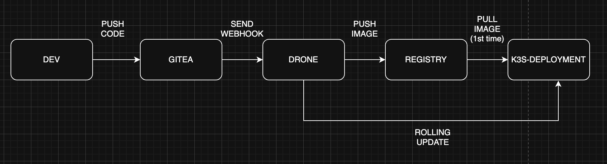

# Homelab Project: Automated CI/CD Pipeline for Kubernetes

A complete, self-hosted CI/CD pipeline built on Proxmox. This project automates the entire process of testing, building a Docker image, and deploying a web application to a K3s Kubernetes cluster triggered by a simple `git push`.

**Core Technologies:** Proxmox, Docker, Docker Compose, Gitea, Drone CI, K3s Kubernetes.

---

## 🏗️ Architecture & Workflow

This project uses a GitOps-like approach where Gitea is the source of truth.

1.  **Code Push:** A developer pushes code changes to a **Gitea** repository.
2.  **Webhook Trigger:** Gitea sends a webhook to the **Drone CI** server.
3.  **CI Pipeline (Drone Runner):**
    -   **Test:** Lints the application code to ensure quality.
    -   **Build & Push:** Builds a new Docker image from the `Dockerfile` and pushes it to a **Private Docker Registry**. The image is uniquely tagged with the Git commit hash.
4.  **CD Pipeline (Drone Runner):**
    -   **Deploy:** The runner uses a secure Kubeconfig to connect to the **K3s Kubernetes cluster**.
    -   It executes a `kubectl set image` command, triggering a **zero-downtime rolling update** of the application's Deployment to the new image version.

---

## 🔧 Project Structure

-   `./private-registry`: Docker Compose stack for the private container registry and its UI.
-   `./cicd-stack`: Docker Compose stack for Gitea, Drone Server, and Drone Runner.
-   `./first-new-pipeline`: Source code for the sample Nginx application, including its `Dockerfile` and the `.drone.yml` pipeline definition.
-   `./drone-sa`: Kubernetes RBAC manifests (ServiceAccount, Role, RoleBinding) to grant Drone secure, limited access to the cluster.
-   `./k8s-deploy`: Kubernetes manifests for the application (Deployment, Service, Ingress).

---

## 🚀 Getting Started

### Prerequisites
- A running Proxmox VE server.
- A `docker-host` VM with Docker & Docker Compose.
- A K3s Kubernetes cluster.

### Setup Steps
1.  **Deploy Services:** Use `docker-compose up -d` to launch the **Private Registry** and the **CI/CD Stack** on your `docker-host`. Remember to configure Docker daemons on all nodes to trust the insecure registry.
2.  **Integrate Gitea & Drone:** Perform the first-time setup for Gitea. Create an OAuth2 application for Drone and update the CI/CD stack's `docker-compose.yml` with the generated Client ID/Secret.
3.  **Grant Kubernetes Access:** Apply the manifests in `./drone-sa` to your K3s cluster. Generate a Kubeconfig file from the created Service Account and save it as a secret named `kubeconfig_drone` in your Drone project settings.
4.  **Activate & Push:** Create a repository in Gitea with the application code, activate it in the Drone UI, and `git push` to trigger the pipeline.

---

## 🌟 Key Features

-   **Fully Automated:** From code commit to live deployment.
-   **Zero-Downtime Deployments:** Using Kubernetes rolling updates.
-   **Secure by Design:** Utilizes a private registry and role-based access control (RBAC) for Kubernetes.
-   **Self-Hosted:** Runs entirely on a personal homelab, perfect for learning and development without cloud costs.
