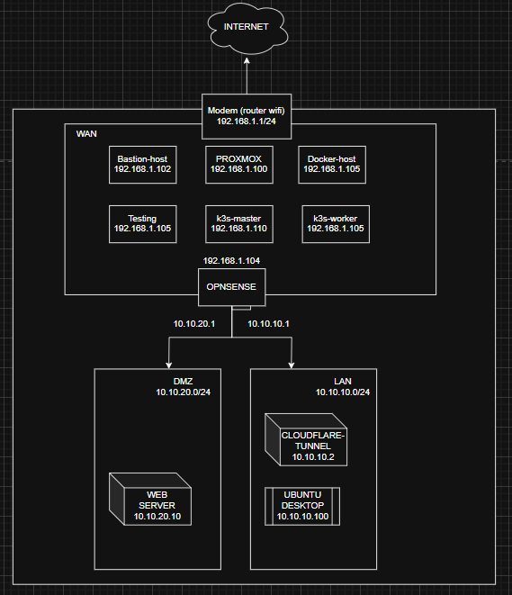

# My Full-Stack Infrastructure Homelab: A DevOps Journey

## 👋 Introduction

Welcome to my personal homelab project! This repository documents my journey of building a complete, modern, and automated infrastructure from the ground up on a single physical server. What started as a learning exercise has evolved into a fully-functional, multi-layered environment that serves as a practical portfolio of my skills in DevOps, System Administration, Networking, and Security.

This entire lab runs on **Proxmox VE** and is managed almost exclusively through **Infrastructure as Code (IaC)** principles, primarily using **Ansible**.

## 1. Solution & Workflow Architecture

This diagram illustrates the overall solution, the main components, and the key workflows for administration, CI/CD, and end-user access. It shows how various tools like Ansible, Docker, Gitea, Drone, and Kubernetes work together to deliver applications.

## 2. Network Foundation & Security Architecture

The entire homelab is built upon a secure, multi-layered network foundation managed by a virtualized OPNsense firewall. This architecture isolates different environments (e.g., Management, DMZ, Secure LAN) to enhance security and control traffic flow.

---

## 🚀 Core Technologies & Skills Demonstrated

This project showcases hands-on experience with a wide range of industry-standard technologies:

*   **Virtualization:** `Proxmox VE`
*   **Networking & Security:** `OPNsense Firewall`, `Network Segmentation (VLANs)`, `Bastion Host`, `Fail2ban`, `Cloudflare Tunnel (CGNAT Traversal)`
*   **Configuration Management (IaC):** `Ansible` (Roles, Playbooks, Templates, Vault)
*   **Containerization:** `Docker`, `Dockerfile`, `Docker Compose`
*   **Container Orchestration:** `Kubernetes (K3s)`
*   **Monitoring:** `Prometheus`, `Grafana`, `Node Exporter`
*   **Linux System Administration:** `Bash Scripting`, `SSH Hardening`, `User Management`, `Service Management (systemd)`

---

## 🗺️ The Journey: From Bare Metal to a Cloud-Native Playground

This repository is structured to reflect the logical progression of the project, mirroring my learning path.

### **Phase 1: Building the Fortress - Foundational Infrastructure**

The first step was to build a secure and segmented foundation. This wasn't just about creating VMs; it was about designing a resilient network architecture.

*   **Virtualization Host:** The entire lab is built upon **Proxmox VE**, providing a powerful and flexible hypervisor for both VMs and lightweight LXC containers.
*   **Network Segmentation:** Using Proxmox's Linux Bridges, the network was segmented into distinct zones:
    *   `vmbr0`: Management Network (connected to the physical LAN).
    *   `vmbr1`: Secure LAN Zone (for internal clients).
    *   `vmbr2`: DMZ (Demilitarized Zone) for public-facing services.
*   **The Network Brain (OPNsense):** A dedicated VM running **OPNsense** acts as the central router and firewall. It controls all traffic between zones, providing DHCP, NAT, and strict firewall policies. The most critical rule: **Block all traffic originating from the DMZ to the LAN.**
*   **Secure Gateway (Bastion Host):** A hardened Debian LXC container serves as the **single entry point** for all administrative SSH access. It is configured with key-only authentication, disabled root login, and `fail2ban` for brute-force protection. This host also serves as the **Ansible Control Node**.

➡️ **Explore the details:** [`4-NETWORK-SECURITY-CONFIGS/`](./4-NETWORK-SECURITY-CONFIGS/)

---

### **Phase 2: Automation with Ansible - The Efficiency Engine**

With a solid foundation, the next phase focused on eliminating manual work and ensuring consistency through automation with Ansible. The principle: "If you have to do it more than once, automate it."

*   **Ansible Roles:** The entire setup is codified into a collection of reusable Ansible Roles. Each role is responsible for a specific component of the infrastructure.
*   **Key Automation Projects:**
    *   **Docker Host Setup:** A role that transforms any fresh Ubuntu/Debian server into a fully configured Docker host.
    *   **K3s Cluster Deployment:** An advanced role that automatically deploys a complete, multi-node K3s Kubernetes cluster, handling master installation and worker node joining.
    *   **Application Deployment:** Roles that deploy complex applications (like WordPress and Monitoring Stacks) using Docker Compose or by applying Kubernetes manifests.

➡️ **Explore the code:** [`1-ANSIBLE-AUTOMATION/`](./1-ANSIBLE-AUTOMATION/)

---

### **Phase 3: Modern Application Deployment - Containers & Orchestration**

This phase moved from managing servers to managing applications using modern, cloud-native patterns.

*   **Containerization with Docker:** Applications like WordPress and the monitoring stack were first containerized using **Docker Compose**. This simplified dependency management and created portable application stacks.

➡️ **Explore the stacks:** [`2-DOCKER-COMPOSE-STACKS/`](./2-DOCKER-COMPOSE-STACKS/)

*   **Orchestration with Kubernetes (K3s):** To manage applications at scale, a **K3s cluster** was deployed. The WordPress application was then migrated to run on Kubernetes.
*   **Kubernetes Manifests as Code:** The entire state of the application on Kubernetes (Deployments, Services, PVCs, Secrets, Ingress) is defined in YAML manifest files, which are templated and managed by Ansible.

➡️ **Explore the manifests:** [`3-KUBERNETES-MANIFESTS/`](./3-KUBERNETES-MANIFESTS/)

---

## ✨ Final Result

The result of this journey is a robust, secure, and highly automated homelab environment. It's not just a collection of technologies, but a cohesive system where I can securely deploy, manage, and monitor applications from anywhere in the world, all managed through code.

Thank you for visiting my portfolio. I am always learning and expanding this project.

---
🔧 Future Enhancements & Next Steps
This project is a living portfolio and is continuously evolving. My next major goal is to implement a complete CI/CD pipeline.
Phase 4: Implementing a Full CI/CD Pipeline (In Progress):
Git Server: Deploying a self-hosted Gitea instance.
CI/CD Engine: Integrating Drone CI to automate the entire workflow.
The Goal: Achieve a "Code to Cluster" pipeline where a git push to Gitea automatically triggers Drone to:
Run tests (linting, etc.).
Build a new Docker image.
Push the image to a private Docker Registry.
Automatically update the corresponding Deployment on the Kubernetes cluster via a rolling update.
➡️ Track the progress: 5-CICD-PIPELINE/
