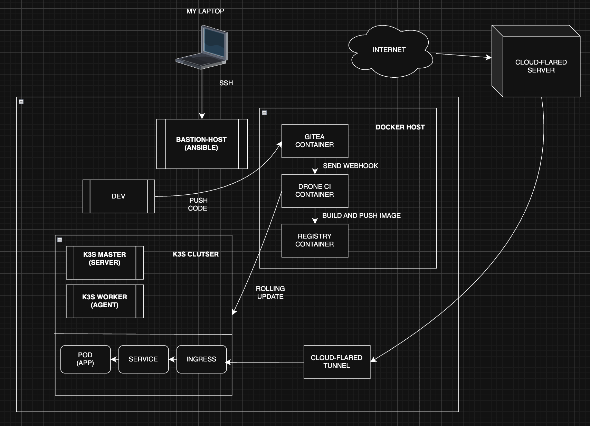
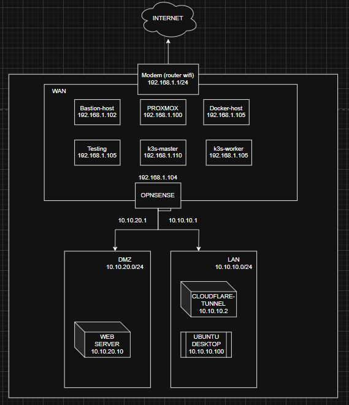

# My Full-Stack Infrastructure Homelab: A DevOps Journey

## 👋 Introduction

Welcome to my personal homelab project! This repository is a showcase of how I built a complete, modern, and automated IT infrastructure from scratch on a single server. It started as a way to learn, but has now become a fully functional environment that demonstrates my hands-on skills in DevOps, system administration, and networking.

This entire lab runs on **Proxmox VE** and is managed using **Infrastructure as Code (IaC)** principles, mainly with **Ansible**.

## 1. How It All Works: Architecture & Workflow

This diagram gives a big-picture view of the setup. It shows how tools like Ansible, Docker, Gitea, Drone, and Kubernetes are connected to automatically build and deploy applications.

## 2. The Foundation: Network & Security

The entire lab is built on a secure, multi-layered network controlled by a virtual **OPNsense firewall**. This design keeps different parts of the network (like the management zone and the public-facing zone) separate for better security.

---

## 🚀 Core Technologies & Skills

This project covers a wide range of popular and in-demand technologies:

*   **Virtualization:** `Proxmox VE`
*   **Networking & Security:** `OPNsense Firewall`, `Network Segmentation (using Linux Bridges)`, `Bastion Host`, `Fail2ban`, `Cloudflare Tunnel`
*   **Configuration Management (IaC):** `Ansible` (Roles, Playbooks, Templates, Vault)
*   **Containerization:** `Docker`, `Dockerfile`, `Docker Compose`
*   **Container Orchestration:** `Kubernetes (K3s)`
*   **Monitoring:** `Prometheus`, `Grafana`, `Node Exporter`
*   **Linux System Administration:** `Bash Scripting`, `SSH Hardening`, `User & Service Management`

---

## 🗺️ The Journey: Step-by-Step Build

This repository is organized to show how the project was built, phase by phase.

### **Phase 1: Building a Secure Foundation**

The first step was to create a safe and organized environment.

*   **Virtualization Host:** The project is built on **Proxmox VE**, which lets me run both full Virtual Machines (VMs) and lightweight Linux Containers (LXC).
*   **Network Zones:** I used Proxmox's Linux Bridges to create separate virtual networks:
    *   `vmbr0`: Management Network (connected to my home LAN).
    *   `vmbr1`: A secure, internal LAN for private services.
    *   `vmbr2`: A DMZ (Demilitarized Zone) for services that need to be accessible from the outside.
*   **The Network Controller (OPNsense):** An **OPNsense** firewall runs in a VM and acts as the main router. It controls all traffic between the different zones with strict firewall rules. The most important rule: **Block all traffic from the DMZ to the secure LAN.**
*   **Secure Access (Bastion Host):** A hardened Debian container is the **only way** to get SSH access for managing the system. It's configured with SSH key-only login and `fail2ban` to block brute-force attacks. This machine is also the **Ansible Control Node**.

➡️ **See the configs:** [`4-NETWORK-SECURITY-CONFIGS/`](./4-NETWORK-SECURITY-CONFIGS/)

---

### **Phase 2: Automating Everything with Ansible**

The next goal was to automate repetitive tasks and keep the setup consistent.

*   **Ansible Roles:** The whole setup process is written as a collection of reusable Ansible Roles.
*   **Key Automation Examples:**
    *   **Docker Host Setup:** A role that takes a fresh Ubuntu/Debian server and turns it into a ready-to-use Docker host.
    *   **K3s Cluster Deployment:** A role that automatically sets up a full K3s Kubernetes cluster, including the master and worker nodes.
    *   **Application Deployment:** Roles that can deploy complex apps (like WordPress) using Docker Compose or Kubernetes YAML files.

➡️ **Check out the code:** [`1-ANSIBLE-AUTOMATION/`](./1-ANSIBLE-AUTOMATION/)

---

### **Phase 3: Modern Apps with Containers & Kubernetes**

This phase was about moving from managing servers to managing applications with modern tools.

*   **Containerizing with Docker Compose:** I started by packaging applications like WordPress and the monitoring stack using **Docker Compose**. This made it easy to manage their dependencies and run them anywhere.

➡️ **See the stacks:** [`2-DOCKER-COMPOSE-STACKS/`](./2-DOCKER-COMPOSE-STACKS/)

*   **Orchestration with Kubernetes (K3s):** To run applications reliably and at scale, I deployed a **K3s cluster**. The WordPress app was then moved to run on Kubernetes.
*   **Kubernetes as Code:** The entire application setup on Kubernetes (Deployments, Services, Storage, Secrets, Ingress) is defined in YAML files, which are managed and deployed by Ansible.

➡️ **See the manifests:** [`3-KUBERNETES-MANIFESTS/`](./3-K-MANIFESTS/)

---

### **Phase 4: The Automated Pipeline (CI/CD)**

This final phase connects everything, creating a fully automated workflow from code to production.

*   **Self-Hosted Git (Gitea) & Private Registry:** I set up a **Gitea** server to host my code and a **private Docker Registry** to store my custom images securely.
*   **Automation with Drone CI:** I used **Drone CI** because it's simple and works great with containers. It's connected to Gitea and triggers automatically.
*   **The Pipeline (`.drone.yml`):** The workflow is defined as code. When I `git push` a change:
    1.  **Trigger:** Gitea notifies Drone via a webhook.
    2.  **Test:** Drone runs a quick check on the code (e.g., HTML linting).
    3.  **Build & Push:** If tests pass, a new Docker image is built and pushed to the private registry, tagged with the unique Git commit ID.
    4.  **Deploy:** Drone then uses `kubectl` to tell the K3s cluster to perform a **zero-downtime rolling update** to the new image version.

➡️ **See the pipeline setup:** [`5-CICD-PIPELINE/`](./5-CICD-PIPELINE/)

---

## ✨ Final Result & What's Next

The result is a powerful, secure, and highly automated homelab that mirrors a real-world DevOps environment. I can now safely deploy and manage applications from anywhere, with all configurations managed through code.

This is an ongoing project, and here's what I'm planning to work on next:

*   **Automate VM Creation** with **Terraform**.
*   Implement **High-Availability Storage** for Kubernetes using **Longhorn**.
*   Set up **Automatic HTTPS** for my services with **Cert-Manager**.
*   Learn to package my applications with **Helm**.

Thanks for checking out my project!
